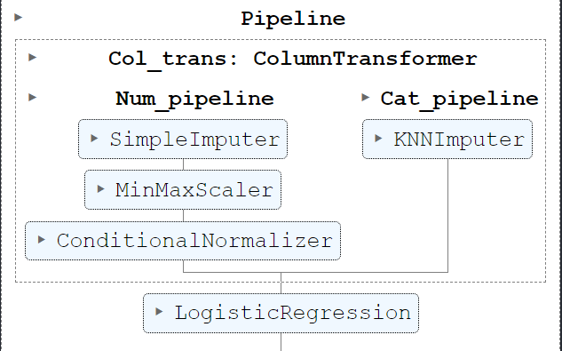

### Wine Dataset
The wine dataset(available in scikit-learn) is a popular dataset used for multinomial classification. It contains 13 float features and three different classes.

- The imputation is done via SimpleImputer and KNNImputer.
- The numerical data is transformed using a scalar and a normalizer which are tuned using GridSearchCV.
- The optimal classifier is also found using a complex pipeline and GridSearchCV.

**Model :** [Wine model](../model/wine.pkl)  
**Pipeline :** [Wine pipeline](../pipe/wine_pipeline.joblib)  
**Source Code :** [Wine prediction source code](../src/wine.ipynb)